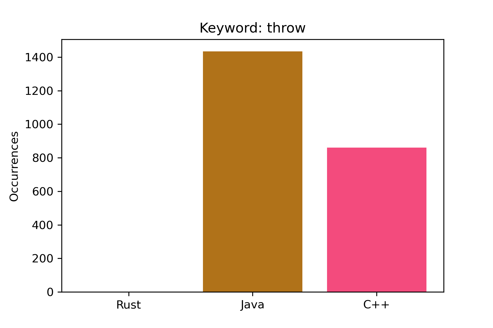
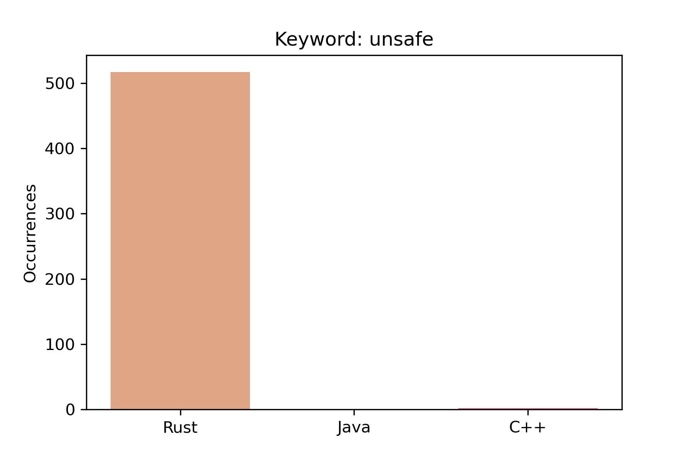
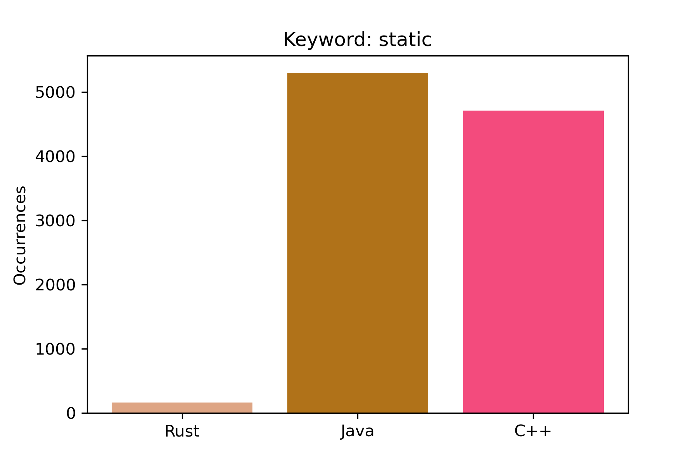
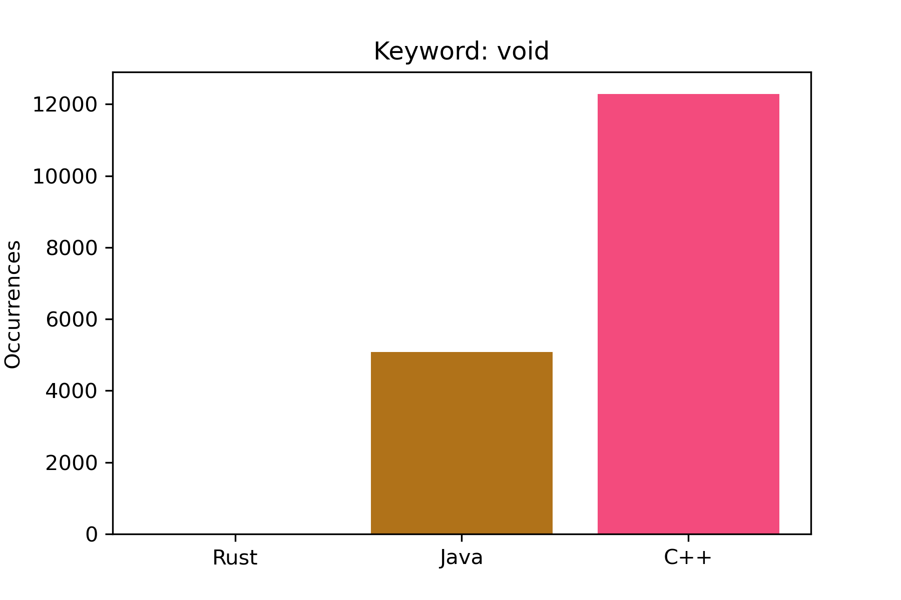
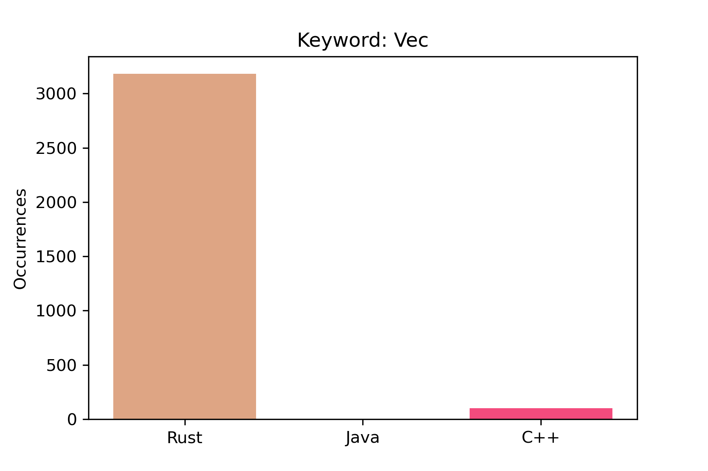
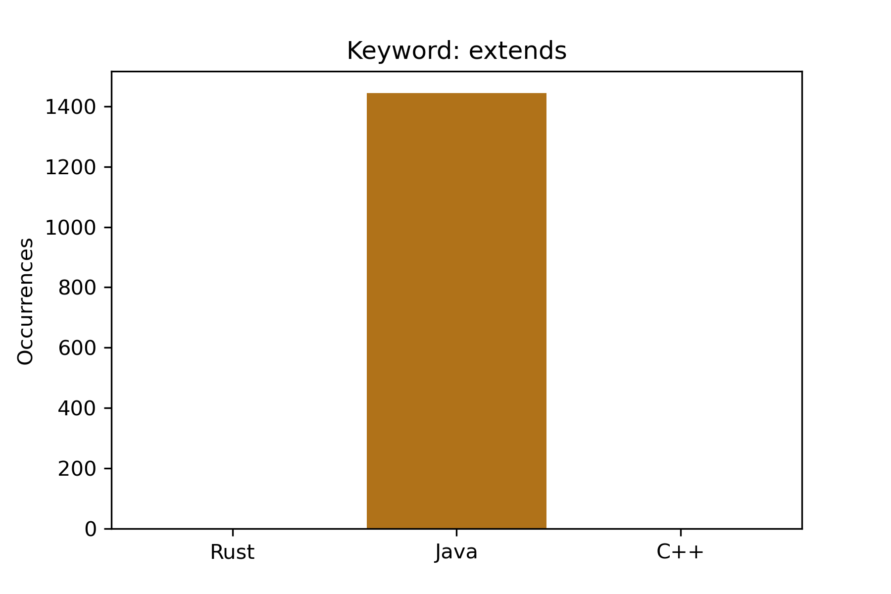
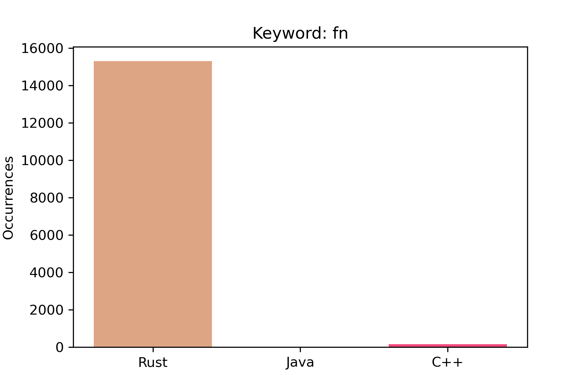
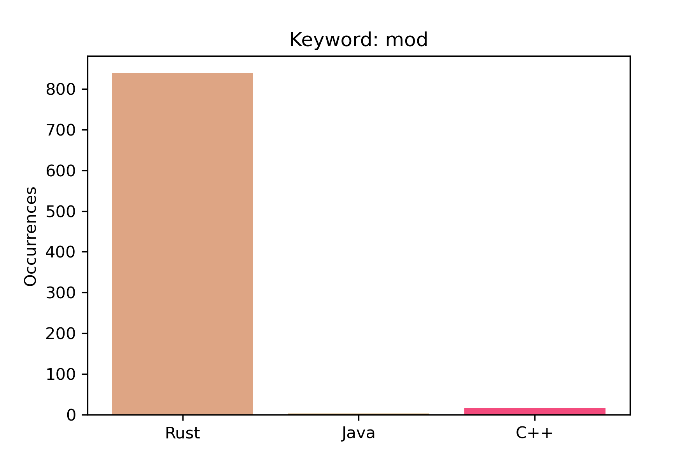
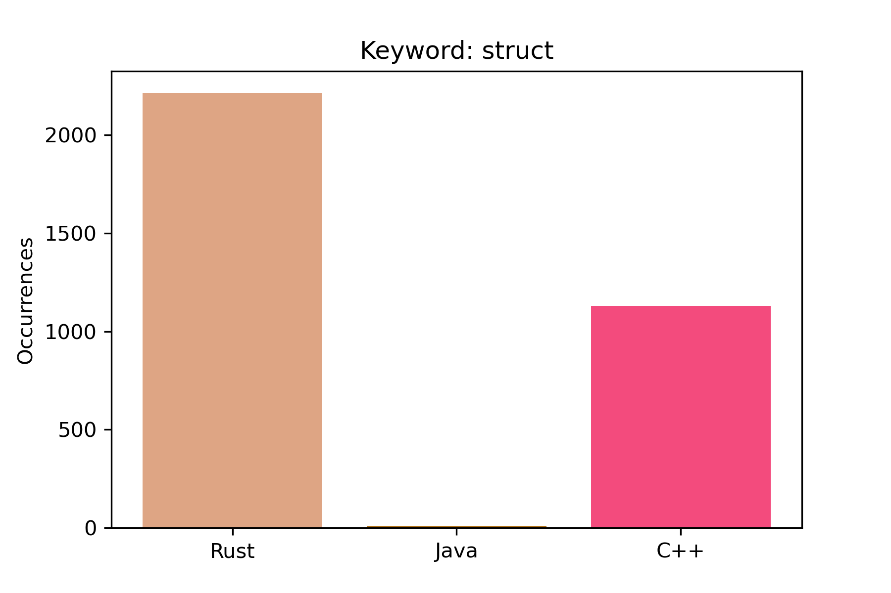
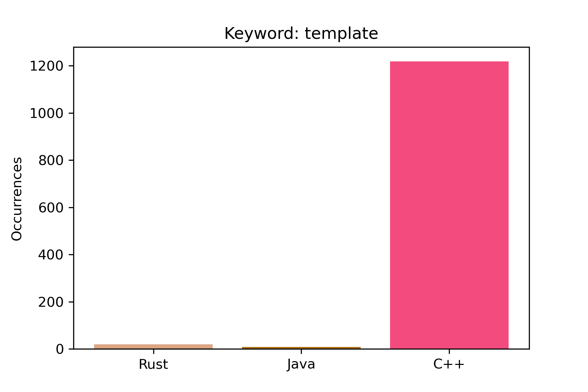

# Chimera

This project aims to determine the programming language used in a given input file
without relying on the file extension.

Supported languages:
- C++
- Java
- Rust

# Contents

1. [Math model](#Math-model)

2. [Run locally](#Run-locally)

3. [Code rundown](#Code-rundown)

4. [Results](#Results)

5. [References](#References)

# Math model

# Multinomial Naive Bayes Classifier

Our project implements a Multinomial Naive Bayes Classifier.  
The heart of the algorithm lies in **Bayes' Formula**, which states:

$$
P(A | B) = \frac{P(B | A) \cdot P(A)}{P(B)}
$$

## Prior Probabilities

We start by computing the **Prior Probabilities**, which represent the probability that a new file is either a C++, Java, or Rust file, without considering its contents. These probabilities are calculated as follows:

$$
P(\text{language}) = \frac{\text{Nr. of language files}}{\text{Total nr. of files}}
$$

## Conditional Probabilities

Next, we calculate the conditional probabilities for each **keyword** given that the file is of a particular language. This is done as follows:

$$
P(\text{keyword | language}) = \frac{\text{count of keyword in language + smoothing}}{(\text{total nr. of keywords in language}) + \text{smoothing} \times \text{nr. of keywords}}
$$

This computation takes place in the `calc_probabilities` function, where we use **Laplace smoothing** to handle cases of zero occurrences. (See **Practical Considerations** below.)

## Posterior Probabilities

Finally, we calculate the posterior probabilities for each language. We start by setting the initial probabilities to the natural logarithm of the **Prior Probabilities**:

$$P(\text{language}) = \ln(\text{Prior Probability})$$

Then, for each keyword we find in our file, we add the natural log of the conditional probability:

$$
P(\text{language}) += \ln(P(\text{keyword | language}))
$$

The model's prediction is the language with the highest posterior probability. This process takes place in the `classify` function. 

Using logarithms rather than multiplying the conditional probabilities helps prevent underflow (see **Practical Considerations**).

---

# Practical Considerations

### Laplace Smoothing

Laplace smoothing is a technique to handle cases where certain keywords may not appear in the training data for a given class. This smoothing avoids zero probabilities. Using a non zero value for the smoothing gave an increase in accuracy of about 25%

### Log Probabilities

- The conditional probabilities for each class given an attribute value are small. When they are multiplied together they result in very small values, which can lead to floating point underflow. A common fix for this is to add the log of the probabilities together
- The usual approach is to use the following formula, where the denominator can be removed as it is constant:

$$
P(y \vert x_1, \dots, x_n) = \frac{P(y) \prod_{i=1}^{n} P(x_i \vert y)}{P(x_1) P(x_2) \dots P(x_n)}
$$

which is mathematically equivalent to the logarithmic approach given the property:

$$
\ln(x \cdot y) = \ln(x) + \ln(y)
$$

---

# Run locally

Versions used:
- Python3: 3.12.7
- Matplotlib: 3.9.2
- Numpy: 2.1.3

We do not provide the samples we use directly, what we provide are the results
of our training which you can just use. If you wish to train this model with
your own data we do provide the mechanism for this.

Regardless of your choice you should first do:

```bash
git clone git@github.com:lucan8/chimera.git
cd chimera
pip install -r requirements.txt
```

### Use our results

Find a source code you would like to test (remember as of now we only can
test for C++, Rust and Java) and put the file contents in `input.txt`, now run
`python3 main.py` and that is our prediction.

### Use your own data

To train our model you will need lots of `.rs`, `.cpp` and `.java` files,
we recommend you clone repos for this, we used [this repos](#References).

`parser.py` will do the heavy lifting for your, just make sure you clone the repos
inside a directory `samples` (it is not in the repo by default).

```bash
mkdir samples
cd samples

// depth = 1 to clone the repos faster
git clone <ssh_for_project1> --depth=1
git clone <ssh_for_project2> --depth=1

...
more repos
...

cd ..

// To analyze the repos and split the files into test files and train files
python3 parser.py

// Train the model
python3 train.py

// (Optional) This will generate graphs for every keyword and show how many
// times a keyword appears in each language.
//
// The plots are in the `plots` directory.
python3 keywords_plot.py

// Add your sample input to input.txt
cat > input.txt (or just use a text editor)

// Make a prediction
python3 main.py
```

You could also change the keywords that are being used, if you wish to do so
just change `keywords.txt`.

The results of the parsing are in `{language}_results.txt`, here is what
everything means:

```
rs_results.txt
--------------

total tokens in all the .rs files
|
|        total number of .rs files
|        |
v        v
1514129 855
        
keyword
|
|    number of times the keyword appeared
|    |
v    v
new 489
...
```

# Code rundown

Here is how some of the things works.

Our project has 3 steps:

1. Parsing
2. Training 

#### 1. Parsing

In this step our parser first `flatten()`s the `samples` directory to determin
the paths for language specific files, 20% of this files are used for `training`
and the 80% to extract tokens.


`extract_data()`
There are all sorts of ways in which you can tokenize a file but we choose
to split every line in a file by ['\t', '\n', '<', '>', '(', ')', '{', '}', '!',
'=', '*', '+', '-', '&', ';', ':', '|', '^', '%', ']', '+'] and we check which
of this tokens match certain keywords and cound how many tokens we have encountered.

This process happens for every language and then we write the data to a specific file
mentioned in a previous section.

#### 2. Training

# Results

In `results.png` the light green means how many of the test data were of that
programming language type, the light blue means how many of that programming
language the model predicted.

So we can notice two interesting facts:

1. The model predicted that there are more `Java` files than there were
(not so surprising knowing that there were more Java files than the rest).

2. The dark green you see is the combination of the two colors and it shows
how it guessed relative to how many there were.



























# References

## Samples repos
- For C++: https://github.com/opencv/opencv
- For Java: https://github.com/plantuml/plantuml
- For Rust: https://github.com/zed-industries/zed
## Helpful links
- https://www.geeksforgeeks.org/naive-bayes-classifiers/
- https://en.wikipedia.org/wiki/Additive_smoothing
- https://machinelearningmastery.com/naive-bayes-classifier-scratch-python/
- https://www.youtube.com/watch?v=O2L2Uv9pdDA&ab_channel=StatQuestwithJoshStarmer
